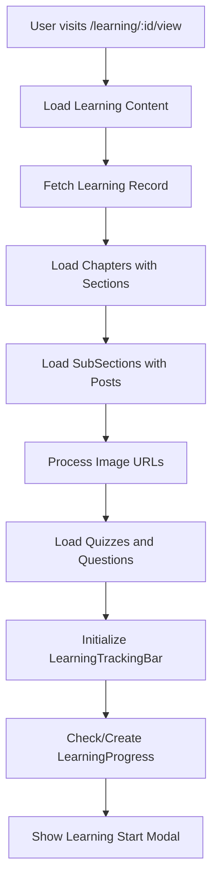
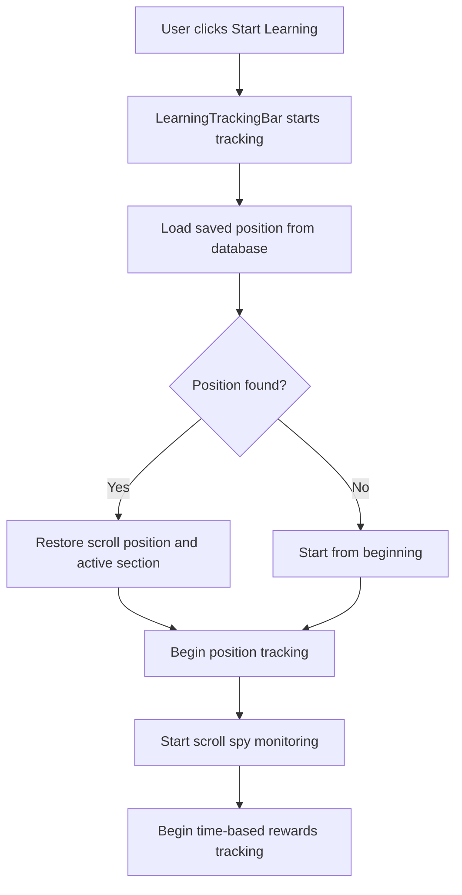
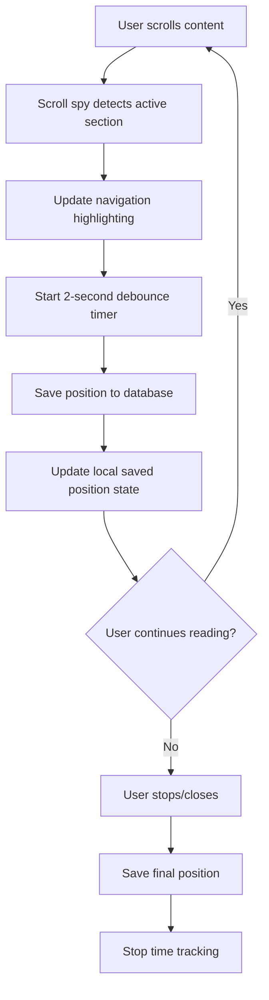
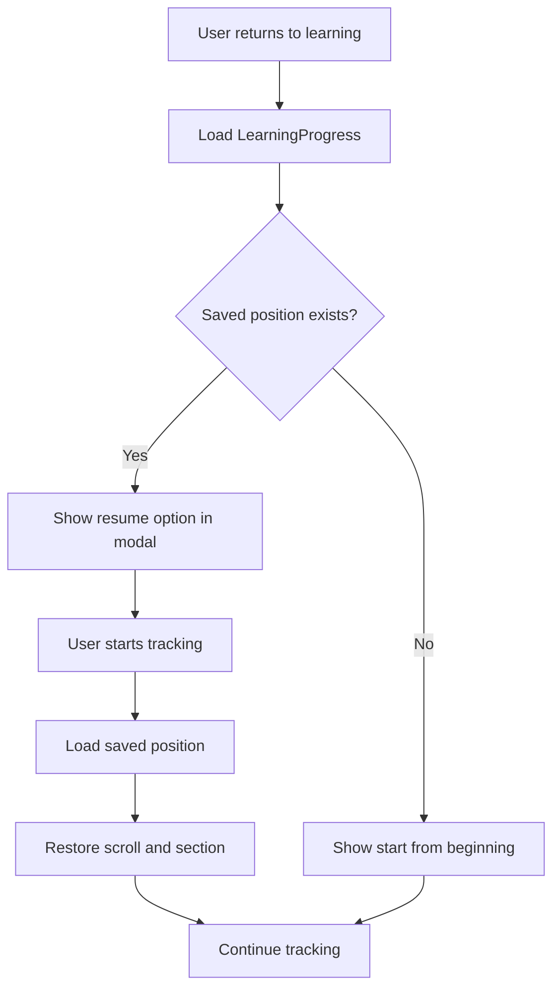

# Complete Learning Module Implementation with Position Tracking

## Overview

This documentation covers the complete implementation of the learning module system in VibeStack, including:
- Hierarchical content structure (Learning → Chapters → Sections → SubSections)
- Content loading with GraphQL queries
- Real-time position tracking and restoration
- Scroll spy functionality for active section highlighting
- Learning progress tracking with time-based rewards
- Cross-device synchronization

The learning system allows users to read structured educational content, automatically tracks their progress, saves their reading position, and enables them to resume exactly where they left off across different sessions and devices.

## Architecture

### Complete Learning Data Model

The learning system uses a hierarchical structure with the following models:

#### 1. Learning (Root Level)
```graphql
type Learning @model @auth(rules: [{allow: public}]) {
  id: ID!
  orderIndex: Int
  title: String!
  description: String
  chapters: [Chapter] @hasMany(indexName: "byLearning", fields: ["id"])
  quizzes: [Quiz] @hasMany(indexName: "byLearning", fields: ["id"])
  learningProgress: [LearningProgress] @hasMany(indexName: "byLearning", fields: ["id"])
  images: [LearningImage] @hasMany(indexName: "byLearning", fields: ["id"])
  quizScore: Float
  quizStatementsCount: Int
  hasQuizTaken: Boolean
  isDefault: Boolean
  readTime: String
  organizationID: ID @index(name: "byOrganization")
  organization: Organization @belongsTo(fields: ["organizationID"])
  clonedFromID: ID
  createdAt: AWSDateTime
  updatedAt: AWSDateTime
  _version: Int
  _deleted: Boolean
  _lastChangedAt: AWSTimestamp
}
```

#### 2. Chapter (Level 1)
```graphql
type Chapter @model @auth(rules: [{allow: public}]) {
  id: ID!
  title: String!
  slug: String
  position: Int
  postId: ID
  post: Post @hasOne(fields: ["postId"])
  learningId: ID! @index(name: "byLearning", sortKeyFields: ["position"])
  learning: Learning @belongsTo(fields: ["learningId"])
  sections: [Section] @hasMany(indexName: "byChapter", fields: ["id"])
  organizationId: ID @index(name: "byOrganization")
  isDefault: Boolean
  createdAt: AWSDateTime
  updatedAt: AWSDateTime
  _version: Int
  _deleted: Boolean
  _lastChangedAt: AWSTimestamp
}
```

#### 3. Section (Level 2)
```graphql
type Section @model @auth(rules: [{allow: public}]) {
  id: ID!
  title: String!
  slug: String
  position: Int
  chapterId: ID! @index(name: "byChapter", sortKeyFields: ["position"])
  chapter: Chapter @belongsTo(fields: ["chapterId"])
  subSections: [SubSection] @hasMany(indexName: "bySection", fields: ["id"])
  organizationId: ID @index(name: "byOrganization")
  postId: ID
  post: Post @hasOne(fields: ["postId"])
  isDefault: Boolean
  createdAt: AWSDateTime
  updatedAt: AWSDateTime
  _version: Int
  _deleted: Boolean
  _lastChangedAt: AWSTimestamp
}
```

#### 4. SubSection (Level 3)
```graphql
type SubSection @model @auth(rules: [{allow: public}]) {
  id: ID!
  title: String!
  slug: String
  position: Int
  sectionId: ID! @index(name: "bySection", sortKeyFields: ["position"])
  section: Section @belongsTo(fields: ["sectionId"])
  postId: ID
  post: Post @hasOne(fields: ["postId"])
  organizationId: ID @index(name: "byOrganization")
  createdAt: AWSDateTime
  updatedAt: AWSDateTime
  _version: Int
  _deleted: Boolean
  _lastChangedAt: AWSTimestamp
}
```

#### 5. Post (Content Storage)
```graphql
type Post @model @auth(rules: [{allow: public}]) {
  id: ID!
  content: String!           # HTML content with images, text, etc.
  organizationId: ID @index(name: "byOrganization")
  isDefault: Boolean
  createdAt: AWSDateTime
  updatedAt: AWSDateTime
  _version: Int
  _deleted: Boolean
  _lastChangedAt: AWSTimestamp
}
```

### Learning Progress & Position Tracking Schema

The `LearningProgress` model in the GraphQL schema (`/amplify/backend/api/lfapi/schema.graphql`) has been extended with three new optional fields:

```graphql
type LearningProgress @model 
  @auth(rules: [{allow: public}]) {
  id: ID!
  userSub: String! @index(name: "byUser")
  organizationID: ID! @index(name: "byOrganization")
  learningID: ID! @index(name: "byLearning")
  learning: Learning @belongsTo(fields: ["learningID"])
  
  # Existing progress tracking fields...
  chaptersCompleted: [String]
  sectionsViewed: [String]
  totalTimeSpent: Int
  lastAccessedAt: AWSDateTime
  completionPercentage: Float
  firstAccessedAt: AWSDateTime
  totalSessions: Int
  averageSessionDuration: Int
  
  # NEW: Reading position tracking fields
  lastViewedSection: String    # ID of the last section user was reading
  lastScrollPosition: Int      # Scroll position in pixels where user left off
  readingSessionData: AWSJSON  # JSON object with detailed reading session info
  
  createdAt: AWSDateTime!
  updatedAt: AWSDateTime!
  _version: Int
  _deleted: Boolean
  _lastChangedAt: AWSTimestamp
}
```

### Key Features

1. **Hierarchical Content Loading**: Loads Learning → Chapters → Sections → SubSections → Posts in structured order
2. **Automatic Position Saving**: Saves user's scroll position and active section every 2 seconds during reading
3. **Cross-Device Sync**: Uses database storage instead of localStorage for cross-device compatibility
4. **Section-Level Tracking**: Tracks chapters, sections, and subsections with priority-based detection
5. **Image URL Processing**: Automatically refreshes expired S3 image URLs in content
6. **Debounced Updates**: Prevents excessive API calls with 2-second debouncing
7. **Session Data**: Stores metadata like timestamp, viewport height, and user agent
8. **Graceful Degradation**: Continues working even if position data is unavailable
9. **Quiz Integration**: Loads and displays quizzes associated with learning modules
10. **Learning Progress Integration**: Works with existing learning tracking and rewards system

## Complete Content Loading Implementation

### 1. Main Content Loading Function

The `fetchLearningContent` function loads the complete hierarchical structure:

```javascript
const fetchLearningContent = async (id) => {
  try {
    // Step 1: Load the main Learning record
    const learningResponse = await API.graphql({
      query: queries.getLearning,
      variables: { id }
    });
    const learningData = learningResponse.data.getLearning;

    // Step 2: Load all Chapters for this Learning (sorted by position)
    const chaptersResponse = await API.graphql({
      query: queries.chaptersByLearningIdAndPosition,
      variables: { 
        learningId: id,
        sortDirection: 'ASC'
      }
    });
    const chapters = chaptersResponse.data.chaptersByLearningIdAndPosition.items;

    // Step 3: For each Chapter, load Sections and their content
    const chaptersWithSections = await Promise.all(chapters.map(async chapter => {
      // Load all Sections for this Chapter (sorted by position)
      const sectionsResponse = await API.graphql({
        query: queries.sectionsByChapterIdAndPosition,
        variables: { 
          chapterId: chapter.id,
          sortDirection: 'ASC'
        }
      });

      const sections = await Promise.all(
        sectionsResponse.data.sectionsByChapterIdAndPosition.items
          .filter(section => !section._deleted)
          .map(async section => {
            // Load Post content for each Section
            let post = null;
            if (section.postId) {
              const postResponse = await API.graphql({
                query: queries.getPost,
                variables: { id: section.postId }
              });
              post = postResponse.data.getPost;
              
              // Process content to fix any expired image URLs
              if (post && post.content) {
                post.content = await processContentImages(post.content);
              }
            }

            // Step 4: For each Section, load SubSections
            const subSectionsResponse = await API.graphql({
              query: queries.subSectionsBySectionIdAndPosition,
              variables: { 
                sectionId: section.id,
                sortDirection: 'ASC'
              }
            });

            const subSections = await Promise.all(
              subSectionsResponse.data.subSectionsBySectionIdAndPosition.items
                .filter(subSection => !subSection._deleted)
                .sort((a, b) => (a.position || 0) - (b.position || 0))
                .map(async subSection => {
                  // Load Post content for each SubSection
                  let subSectionPost = null;
                  if (subSection.postId) {
                    const postResponse = await API.graphql({
                      query: queries.getPost,
                      variables: { id: subSection.postId }
                    });
                    subSectionPost = postResponse.data.getPost;
                    
                    // Process content to fix any expired image URLs
                    if (subSectionPost && subSectionPost.content) {
                      subSectionPost.content = await processContentImages(subSectionPost.content);
                    }
                  }
                  return { ...subSection, post: subSectionPost };
                })
            );

            return { ...section, post, subSections };
          })
      );

      return { ...chapter, sections };
    }));

    // Step 5: Load Quizzes for this Learning
    const quizzesResponse = await API.graphql({
      query: queries.listQuizzes,
      variables: {
        filter: {
          learningId: { eq: id },
          _deleted: { ne: true }
        }
      }
    });
    
    const fetchedQuizzes = quizzesResponse.data.listQuizzes.items;
    setQuizzes(fetchedQuizzes);
    
    // Step 6: Load Questions for each Quiz
    const questionsByQuiz = {};
    await Promise.allSettled(fetchedQuizzes.map(async (quiz) => {
      try {
        const questionsResponse = await API.graphql({
          query: queries.questionsByQuizId,
          variables: { 
            quizId: quiz.id,
            filter: { _deleted: { ne: true } }
          }
        });
        
        if (questionsResponse.data?.questionsByQuizId?.items) {
          const questions = questionsResponse.data.questionsByQuizId.items
            .sort((a, b) => {
              if (a.orderIndex !== undefined && b.orderIndex !== undefined) {
                return a.orderIndex - b.orderIndex;
              }
              return new Date(a.createdAt) - new Date(b.createdAt);
            });
            
          questionsByQuiz[quiz.id] = questions;
        } else {
          questionsByQuiz[quiz.id] = [];
        }
      } catch (err) {
        console.warn(`Error fetching questions for quiz ${quiz.id}:`, err);
        questionsByQuiz[quiz.id] = [];
      }
    }));
    
    setQuizQuestions(questionsByQuiz);

    // Step 7: Set the complete learning data structure
    setLearning({ ...learningData, chapters: chaptersWithSections });
    setLoading(false);
    
  } catch (error) {
    console.error("Error fetching learning content:", error);
    setError(error.message);
    setLoading(false);
  }
};
```

### 2. Image URL Processing

The system automatically processes and refreshes expired S3 image URLs:

```javascript
const processContentImages = async (content) => {
  if (!content) return content;
  
  try {
    let updatedContent = content;
    
    // Find all image src attributes in the content
    const imgRegex = /]+src="([^"]+)"/g;
    const matches = [...content.matchAll(imgRegex)];
    
    for (const match of matches) {
      const fullMatch = match[0];
      const src = match[1];
      
      if (!src) continue;
      
      console.log('🔍 Processing image src in view:', src);
      
      // Check if this is already a public URL
      if (src.includes('amazonaws.com') && !src.includes('?')) {
        console.log('Image already has public URL, skipping:', src);
        continue;
      }
      
      // Determine if it's already an S3 key or a full URL
      let s3Key = src;
      let needsRefresh = false;
      
      // Case 1: Full URL with query parameters (expired signed URL)
      if (src.includes('amazonaws.com')) {
        needsRefresh = true;
        // Remove query parameters and extract key
        if (s3Key.includes('?')) {
          s3Key = s3Key.split('?')[0];
        }
        if (s3Key.includes('amazonaws.com/')) {
          const parts = s3Key.split('amazonaws.com/');
          if (parts.length > 1) {
            s3Key = parts[1];
          }
        }
      }
      // Case 2: Just the S3 key (e.g., "learning-images/...")
      else if (src.includes('learning-images/')) {
        needsRefresh = true;
        s3Key = src;
      }
      
      if (needsRefresh) {
        try {
          console.log('Generating public URL for S3 key:', s3Key);
          
          // Generate public URL directly
          let publicUrl;
          if (s3Key.includes('learning-images/')) {
            const learningBucket = process.env.REACT_APP_LEARNING_IMAGES_BUCKET;
            const region = awsExports.aws_user_files_s3_bucket_region;
            publicUrl = `https://${learningBucket}.s3.${region}.amazonaws.com/${s3Key}`;
          } else {
            const bucketName = awsExports.aws_user_files_s3_bucket;
            const region = awsExports.aws_user_files_s3_bucket_region;
            publicUrl = `https://${bucketName}.s3.${region}.amazonaws.com/public/${s3Key}`;
          }
          
          console.log('Generated public URL:', publicUrl);
          
          // Replace the img tag's src attribute
          const newImgTag = fullMatch.replace(src, publicUrl);
          updatedContent = updatedContent.replace(fullMatch, newImgTag);
        } catch (error) {
          console.error('Error generating public URL:', error);
        }
      }
    }
    
    return updatedContent;
  } catch (error) {
    console.error('Error processing content images:', error);
    return content;
  }
};
```

### 3. Content Rendering Structure

The loaded content is rendered in a hierarchical structure:

```javascript
const renderContent = () => {
  return (
    <div className="p-4">
      {learning?.chapters?.map((chapter, chapterIndex) => (
        <div 
          key={chapter.id} 
          id={`chapter-${chapter.id}`} 
          className={`mb-5 ${activeSection === `chapter-${chapter.id}` ? 'content-section-active' : ''}`}
          ref={(el) => setSectionRef(`chapter-${chapter.id}`, el)}
        >
          {/* Chapter Title */}
          <h2 className="mb-4 chapter-title">
            {chapterIndex + 1}. {chapter.title}
          </h2>

          {/* Chapter Sections */}
          {chapter.sections?.map((section, sectionIndex) => (
            <div 
              key={section.id} 
              id={`section-${section.id}`} 
              className={`mb-5 ${activeSection === `section-${section.id}` ? 'content-section-active' : ''}`}
              ref={(el) => setSectionRef(`section-${section.id}`, el)}
            >
              {/* Section Title */}
              <h3 className="mb-4 section-title">
                {chapterIndex + 1}.{sectionIndex + 1} {section.title}
              </h3>
              
              {/* Section Content */}
              {section.post?.content && (
                <div 
                  className="content-section mb-5"
                  dangerouslySetInnerHTML={{ __html: section.post.content }}
                />
              )}

              {/* SubSections */}
              {section.subSections?.map((subSection, subSectionIndex) => (
                <div 
                  key={subSection.id} 
                  id={`subsection-${subSection.id}`}
                  className={`ms-4 mb-5 ${activeSection === `subsection-${subSection.id}` ? 'content-section-active' : ''}`}
                  ref={(el) => setSectionRef(`subsection-${subSection.id}`, el)}
                >
                  {/* SubSection Title */}
                  <h4 className="mb-4 subsection-title">
                    {chapterIndex + 1}.{sectionIndex + 1}.{subSectionIndex + 1} {subSection.title}
                  </h4>
                  
                  {/* SubSection Content */}
                  {subSection.post?.content && (
                    <div 
                      className="content-section"
                      dangerouslySetInnerHTML={{ __html: subSection.post.content }}
                    />
                  )}
                </div>
              ))}
            </div>
          ))}
        </div>
      ))}
    </div>
  );
};
```

### 4. Navigation Generation

The table of contents navigation is generated from the loaded content structure:

```javascript
const renderNavigation = () => {
  if (!learning?.chapters) return null;

  return (
    <ListGroup variant="flush">
      {learning.chapters.map((chapter, chapterIndex) => (
        <div key={chapter.id}>
          {/* Chapter Navigation Item */}
          <ListGroup.Item
            action
            onClick={() => scrollToSection(`chapter-${chapter.id}`)}
            active={activeSection === `chapter-${chapter.id}`}
            className="d-flex align-items-center"
            style={{
              ...styles.listItem,
              ...(activeSection === `chapter-${chapter.id}` ? styles.activeListItem : {})
            }}
          >
            <span className="me-2">📚</span>
            {chapterIndex + 1}. {chapter.title}
          </ListGroup.Item>
          
          {/* Section Navigation Items */}
          {chapter.sections?.map((section, sectionIndex) => (
            <div key={section.id}>
              <ListGroup.Item
                action
                onClick={() => scrollToSection(`section-${section.id}`)}
                active={activeSection === `section-${section.id}`}
                className="ms-3"
                style={{
                  ...styles.listItem,
                  ...(activeSection === `section-${section.id}` ? styles.activeListItem : {})
                }}
              >
                <span className="me-2">📑</span>
                {chapterIndex + 1}.{sectionIndex + 1} {section.title}
              </ListGroup.Item>

              {/* SubSection Navigation Items */}
              {section.subSections?.map((subSection, subSectionIndex) => (
                <ListGroup.Item
                  key={subSection.id}
                  action
                  onClick={() => scrollToSection(`subsection-${subSection.id}`)}
                  active={activeSection === `subsection-${subSection.id}`}
                  className="ms-5"
                  style={{
                    ...styles.listItem,
                    ...(activeSection === `subsection-${subSection.id}` ? styles.activeListItem : {})
                  }}
                >
                  <span className="me-2">📄</span>
                  {chapterIndex + 1}.{sectionIndex + 1}.{subSectionIndex + 1} {subSection.title}
                </ListGroup.Item>
              ))}
            </div>
          ))}
        </div>
      ))}
    </ListGroup>
  );
};
```

## Learning Tracking Integration

### 1. Learning Tracking Bar Integration

The position tracking works seamlessly with the existing `LearningTrackingBar` component:

```javascript
// Learning Tracking Bar integration
<LearningTrackingBar 
  ref={trackingBarRef}
  learningId={learningId} 
  learningTitle={learning?.title}
  onTrackingStateChange={handleTrackingStateUpdate}
  onTrackingStopped={handleStopTracking}
  isHidden={showStartModal}
/>
```

### 2. Learning Start Modal Integration

The system includes a modal for starting/resuming learning sessions:

```javascript
<LearningStartModal
  show={showStartModal && trackingState.progressLoaded && trackingState.progressId && readyToShowModal}
  learningTitle={learning?.title}
  learningId={learningId}
  isTracking={trackingState.isTracking}
  sessionElapsedTime={trackingState.sessionElapsedTime}
  activeTime={trackingState.activeTime}
  totalTimeSpent={trackingState.totalTimeSpent}
  isUserActive={trackingState.isUserActive}
  isTabVisible={trackingState.isTabVisible}
  onStartTracking={handleStartTracking}
  onStopTracking={handleStopTracking}
  onClose={handleModalClose}
  trackingBarRef={trackingBarRef}
  progressId={trackingState.progressId}
/>
```

### 3. Tracking State Management

The tracking state contains all necessary information for position tracking:

```javascript
const [trackingState, setTrackingState] = useState({
  isTracking: false,           // Whether user is currently reading
  sessionElapsedTime: 0,       // Current session time
  activeTime: 0,               // Time user was actively reading
  totalTimeSpent: 0,           // Total time across all sessions
  isUserActive: true,          // Whether user is currently active
  isTabVisible: true,          // Whether browser tab is visible
  progressLoaded: false,       // Whether progress data has loaded
  progressId: null             // ID of the LearningProgress record
});

// Handle tracking state updates from LearningTrackingBar
const handleTrackingStateUpdate = useCallback((newState) => {
  setTrackingState(prev => ({ ...prev, ...newState }));
  
  // Show modal when progress is loaded and user is not tracking
  if (newState.progressLoaded && newState.progressId && !newState.isTracking && !showStartModal) {
    console.log('🎯 Progress loaded with valid ID - ready to show modal', {
      progressId: newState.progressId,
      progressLoaded: newState.progressLoaded,
      reason: readyToShowModal ? 'after_stop' : 'initial_load'
    });
    if (!readyToShowModal) {
      setReadyToShowModal(true);
    }
    setShowStartModal(true);
  }
}, [readyToShowModal, showStartModal]);
```

## Complete User Flow

### 1. Initial Learning Load



### 2. Learning Session Start



### 3. Active Reading Session



### 4. Resume Learning Session



## Data Flow Diagrams

### Content Loading Flow

```javascript
// Sequence of GraphQL queries for loading complete learning content
Loading Learning Content:
┌─────────────────────────────────────────────┐
│ 1. getLearning(id) → Learning record        │
│ 2. chaptersByLearningIdAndPosition() →      │
│    Chapters sorted by position              │
│ 3. For each Chapter:                        │
│    ├── sectionsByChapterIdAndPosition() →   │
│    │   Sections sorted by position          │
│    └── For each Section:                    │
│        ├── getPost(postId) → Section content│
│        ├── processContentImages() →         │
│        │   Refresh expired S3 URLs          │
│        └── subSectionsBySectionIdAndPosition│
│            └── For each SubSection:         │
│                └── getPost(postId) →        │
│                    SubSection content       │
│ 4. listQuizzes() → Quiz records             │
│ 5. For each Quiz:                           │
│    └── questionsByQuizId() → Questions      │
└─────────────────────────────────────────────┘
```

### Position Tracking Flow

```javascript
// How position tracking works during reading session
Position Tracking Flow:
┌─────────────────────────────────────────────┐
│ User Scrolls                                │
│ ↓                                           │
│ Scroll Event → updateActiveSection()        │
│ ↓                                           │
│ Calculate visibility & priority             │
│ ├── Subsections (priority 3)               │
│ ├── Sections (priority 2)                  │
│ └── Chapters (priority 1)                  │
│ ↓                                           │
│ Update activeSection state                  │
│ ↓                                           │
│ Trigger position save useEffect             │
│ ↓                                           │
│ 2-second debounce timer                     │
│ ↓                                           │
│ updateLearningProgress mutation             │
│ ├── lastViewedSection: activeSection       │
│ ├── lastScrollPosition: scrollTop          │
│ └── readingSessionData: JSON metadata      │
│ ↓                                           │
│ Update local savedPosition state            │
└─────────────────────────────────────────────┘
```

## State Management Architecture

### Component State Structure

```javascript
// Complete state structure for LearningView component
const LearningView = () => {
  // Core content data
  const [learning, setLearning] = useState(null);
  const [loading, setLoading] = useState(true);
  const [error, setError] = useState(null);
  const [quizzes, setQuizzes] = useState([]);
  const [quizQuestions, setQuizQuestions] = useState({});
  
  // Navigation and scroll spy
  const [activeSection, setActiveSection] = useState(null);
  
  // Position tracking
  const [savedPosition, setSavedPosition] = useState(null);
  const positionSaveTimeout = useRef(null);
  
  // Learning session management
  const [showStartModal, setShowStartModal] = useState(false);
  const [readyToShowModal, setReadyToShowModal] = useState(false);
  const [trackingState, setTrackingState] = useState({
    isTracking: false,
    sessionElapsedTime: 0,
    activeTime: 0,
    totalTimeSpent: 0,
    isUserActive: true,
    isTabVisible: true,
    progressLoaded: false,
    progressId: null
  });
  
  // DOM references
  const trackingBarRef = useRef();
  const contentScrollRef = useRef();
  const sectionRefs = useRef(new Map());
  
  // Additional UI states
  const [downloadingContent, setDownloadingContent] = useState(false);
  const [isRedirecting, setIsRedirecting] = useState(false);
  
  // ... rest of component logic
};
```

### Data Structure After Loading

```javascript
// Complete data structure after fetchLearningContent completes
const loadedLearning = {
  id: "learning-123",
  title: "Lean Manufacturing Fundamentals",
  description: "Introduction to lean principles",
  readTime: "45 minutes",
  organizationID: "org-456",
  chapters: [
    {
      id: "chapter-1",
      title: "Introduction to Lean",
      position: 0,
      postId: null, // Chapters may not have direct content
      post: null,
      sections: [
        {
          id: "section-1-1",
          title: "What is Lean?",
          position: 0,
          postId: "post-100",
          post: {
            id: "post-100",
            content: "<h3>Lean manufacturing is...</h3><p>Content with </p>",
            organizationId: "org-456"
          },
          subSections: [
            {
              id: "subsection-1-1-1",
              title: "Historical Background",
              position: 0,
              postId: "post-101",
              post: {
                id: "post-101",
                content: "<p>The history of lean manufacturing...</p>",
                organizationId: "org-456"
              }
            }
            // ... more subsections
          ]
        }
        // ... more sections
      ]
    }
    // ... more chapters
  ],
  // Quiz data loaded separately
  quizzes: [...],
  quizQuestions: { "quiz-id": [...questions] }
};
```

## Implementation Details

### Core Functions

#### 1. Load Saved Position (`loadSavedPosition`)

```javascript
const loadSavedPosition = useCallback(async () => {
  if (!trackingState.progressId || !currentUser || !currentOrganization) return;

  try {
    const progressResponse = await API.graphql({
      query: queries.getLearningProgress,
      variables: { id: trackingState.progressId }
    });

    const progress = progressResponse.data.getLearningProgress;
    if (progress && progress.lastViewedSection && progress.lastScrollPosition !== null) {
      const savedPos = {
        sectionId: progress.lastViewedSection,
        scrollPosition: progress.lastScrollPosition,
        sessionData: progress.readingSessionData ? JSON.parse(progress.readingSessionData) : null
      };
      
      setSavedPosition(savedPos);
      console.log('📖 Loaded saved reading position:', savedPos);
      return savedPos;
    }
  } catch (error) {
    console.error('Error loading saved position:', error);
  }
  return null;
}, [trackingState.progressId, currentUser, currentOrganization]);
```

#### 2. Restore Position (`restorePosition`)

```javascript
const restorePosition = useCallback(async (savedPos) => {
  if (!savedPos || !contentScrollRef.current) return;

  // Wait for content to render
  await new Promise(resolve => setTimeout(resolve, 500));

  try {
    // Set active section first
    setActiveSection(savedPos.sectionId);
    
    // Scroll to saved position
    if (contentScrollRef.current) {
      contentScrollRef.current.scrollTop = savedPos.scrollPosition;
      console.log('🎯 Restored scroll position:', savedPos.scrollPosition);
    }

    // Try to scroll to the specific section as backup
    const sectionElement = sectionRefs.current.get(savedPos.sectionId);
    if (sectionElement) {
      sectionElement.scrollIntoView({ behavior: 'smooth', block: 'start' });
      console.log('📍 Scrolled to saved section:', savedPos.sectionId);
    }
  } catch (error) {
    console.error('Error restoring position:', error);
  }
}, []);
```

#### 3. Position Saving Logic

Position is automatically saved in two scenarios:

**A. During Active Reading (Debounced)**
```javascript
// Save position when active section changes
useEffect(() => {
  if (trackingState.isTracking && activeSection && contentScrollRef.current && 
      trackingState.progressId && currentUser && currentOrganization) {
    
    const currentScrollPosition = contentScrollRef.current.scrollTop;
    
    // Clear existing timeout
    if (positionSaveTimeout.current) {
      clearTimeout(positionSaveTimeout.current);
    }
    
    // Set new timeout to save position after 2 seconds
    positionSaveTimeout.current = setTimeout(() => {
      const readingSessionData = {
        timestamp: new Date().toISOString(),
        sectionId: activeSection,
        scrollPosition: currentScrollPosition,
        userAgent: navigator.userAgent,
        viewportHeight: window.innerHeight
      };

      API.graphql({
        query: mutations.updateLearningProgress,
        variables: {
          input: {
            id: trackingState.progressId,
            lastViewedSection: activeSection,
            lastScrollPosition: currentScrollPosition,
            readingSessionData: JSON.stringify(readingSessionData),
            lastAccessedAt: new Date().toISOString()
          }
        }
      }).then(() => {
        setSavedPosition({ sectionId: activeSection, scrollPosition: currentScrollPosition });
        console.log('💾 Saved reading position:', { sectionId: activeSection, scrollPosition: currentScrollPosition });
      }).catch(error => {
        console.error('Error saving reading position:', error);
      });
    }, 2000);
  }
}, [activeSection, trackingState.isTracking, trackingState.progressId, currentUser, currentOrganization]);
```

**B. When Tracking Stops (Final Save)**
```javascript
// Save position when tracking stops
useEffect(() => {
  if (!trackingState.isTracking && activeSection && contentScrollRef.current && trackingState.progressId) {
    const currentScrollPosition = contentScrollRef.current.scrollTop;
    
    setTimeout(() => {
      if (currentUser && currentOrganization) {
        const readingSessionData = {
          timestamp: new Date().toISOString(),
          sectionId: activeSection,
          scrollPosition: currentScrollPosition,
          userAgent: navigator.userAgent,
          viewportHeight: window.innerHeight
        };

        API.graphql({
          query: mutations.updateLearningProgress,
          variables: {
            input: {
              id: trackingState.progressId,
              lastViewedSection: activeSection,
              lastScrollPosition: currentScrollPosition,
              readingSessionData: JSON.stringify(readingSessionData),
              lastAccessedAt: new Date().toISOString()
            }
          }
        }).then(() => {
          setSavedPosition({ sectionId: activeSection, scrollPosition: currentScrollPosition });
          console.log('💾 Saved final reading position on stop:', { sectionId: activeSection, scrollPosition: currentScrollPosition });
        }).catch(error => {
          console.error('Error saving final reading position:', error);
        });
      }
    }, 100);
  }
}, [trackingState.isTracking, activeSection, trackingState.progressId, currentUser, currentOrganization]);
```

### Scroll Spy Integration

The position tracking is tightly integrated with the scroll spy functionality that detects which section is currently active:

```javascript
const updateActiveSection = useCallback(() => {
  if (!contentScrollRef.current) return;

  const scrollContainer = contentScrollRef.current;
  const scrollTop = scrollContainer.scrollTop;
  const containerHeight = scrollContainer.clientHeight;
  
  // Complex algorithm to detect active section with priority:
  // 1. Subsections (highest priority)
  // 2. Sections (medium priority) 
  // 3. Chapters (lowest priority)
  
  // Implementation includes visibility percentage calculation
  // and distance from viewport center for accurate detection
}, [activeSection]);
```

## Usage Instructions

### 1. Schema Deployment

After adding the new fields to your GraphQL schema:

```bash
# Generate updated models
npm run amplify-modelgen

# Deploy schema changes
amplify push
```

### 2. Component State Requirements

Your learning component needs these state variables:

```javascript
const [savedPosition, setSavedPosition] = useState(null);
const positionSaveTimeout = useRef(null);
const contentScrollRef = useRef(); // Reference to scrollable content container
const sectionRefs = useRef(new Map()); // Map of section IDs to DOM elements
```

### 3. Integration with Existing Learning Tracking

The position tracking integrates with your existing `LearningTrackingBar` component through the `trackingState`:

```javascript
const [trackingState, setTrackingState] = useState({
  isTracking: false,
  sessionElapsedTime: 0,
  activeTime: 0,
  totalTimeSpent: 0,
  isUserActive: true,
  isTabVisible: true,
  progressLoaded: false,
  progressId: null // This is crucial for position tracking
});
```

### 4. Section Reference Setup

Each content section needs a ref for scroll spy detection:

```javascript
// In your JSX render:
<div 
  id={`chapter-${chapter.id}`} 
  ref={(el) => setSectionRef(`chapter-${chapter.id}`, el)}
>
  {/* Chapter content */}
</div>

<div 
  id={`section-${section.id}`} 
  ref={(el) => setSectionRef(`section-${section.id}`, el)}
>
  {/* Section content */}
</div>

<div 
  id={`subsection-${subSection.id}`}
  ref={(el) => setSectionRef(`subsection-${subSection.id}`, el)}
>
  {/* Subsection content */}
</div>
```

### 5. Scroll Container Setup

Your scrollable content container needs the ref:

```javascript
<Col md={9} className="vh-100 overflow-auto" ref={contentScrollRef}>
  {/* Learning content */}
</Col>
```

## Data Structure

### Saved Position Object

```javascript
const savedPosition = {
  sectionId: "subsection-abc123", // ID of the section user was reading
  scrollPosition: 1250,           // Scroll position in pixels
  sessionData: {                  // Additional metadata
    timestamp: "2024-01-15T10:30:00.000Z",
    sectionId: "subsection-abc123",
    scrollPosition: 1250,
    userAgent: "Mozilla/5.0...",
    viewportHeight: 969
  }
};
```

### Database Fields

| Field | Type | Description |
|-------|------|-------------|
| `lastViewedSection` | String | ID of the last section user was reading (e.g., "chapter-123", "section-456", "subsection-789") |
| `lastScrollPosition` | Int | Scroll position in pixels where user left off |
| `readingSessionData` | AWSJSON | JSON object containing detailed session metadata |

## Advanced Features

### 1. Priority-Based Section Detection

The scroll spy uses a sophisticated algorithm to determine the active section:

- **Subsections** have highest priority (priority: 3)
- **Sections** have medium priority (priority: 2)  
- **Chapters** have lowest priority (priority: 1)

This ensures that when multiple sections are visible, the most specific one is highlighted.

### 2. Visibility Calculation

The system calculates how much of each section is visible and prioritizes sections with higher visibility percentage.

### 3. Cross-Device Synchronization

Since data is stored in the database rather than localStorage, users can start reading on one device and continue on another.

### 4. Graceful Error Handling

The system includes comprehensive error handling and will continue to function even if:
- Position data is corrupted
- API calls fail
- DOM elements are not found

## Testing

### Console Logging

The implementation includes extensive console logging for debugging:

```javascript
console.log('📖 Loaded saved reading position:', savedPos);
console.log('🎯 Restored scroll position:', savedPos.scrollPosition);
console.log('💾 Saved reading position:', { sectionId: activeSection, scrollPosition: currentScrollPosition });
console.log('📍 Scrolled to saved section:', savedPos.sectionId);
```

### Test Scenarios

1. **Basic Flow**: Start learning → scroll and read → stop → restart → verify position restored
2. **Cross-Device**: Start on device A → stop → continue on device B → verify position restored
3. **Error Handling**: Corrupt position data → verify graceful degradation
4. **Performance**: Rapid scrolling → verify debouncing works correctly

## Performance Considerations

### 1. Debouncing

Position saves are debounced to 2 seconds to prevent excessive API calls during rapid scrolling.

### 2. Cleanup

Timeouts are properly cleaned up on component unmount to prevent memory leaks:

```javascript
useEffect(() => {
  return () => {
    if (positionSaveTimeout.current) {
      clearTimeout(positionSaveTimeout.current);
    }
  };
}, []);
```

### 3. Conditional Updates

Position saving only occurs when:
- User is actively tracking
- Progress ID is available
- User and organization contexts are loaded
- Content is scrollable

## Backward Compatibility

The new fields are optional, so existing `LearningProgress` records will continue to work without any issues. Users without saved positions will simply start from the beginning, which is the existing behavior.

## Future Enhancements

### 1. Resume Prompt Modal

Add a modal when users return to show:
- "Continue where you left off?"
- Last read section name
- Time since last read
- Option to start from beginning

### 2. Reading Progress Indicator

Show visual progress bar indicating:
- How much of the learning has been read
- Current position within the content
- Estimated time remaining

### 3. Multiple Bookmarks

Allow users to save multiple bookmarks within a single learning module for quick navigation.

### 4. Reading Analytics

Track detailed reading patterns:
- Time spent on each section
- Reading speed
- Most re-read sections
- Completion patterns

## Troubleshooting

### Common Issues

1. **Position not restoring**: Check that `progressId` is available and valid
2. **Scroll spy not working**: Verify section refs are properly set
3. **Excessive API calls**: Confirm debouncing is working (2-second delay)
4. **Position saving on wrong section**: Check active section detection algorithm

### Debug Commands

```javascript
// Check current state
console.log('Current tracking state:', trackingState);
console.log('Saved position:', savedPosition);
console.log('Active section:', activeSection);
console.log('Section refs:', sectionRefs.current);

// Test position loading
loadSavedPosition().then(pos => console.log('Loaded position:', pos));

// Check scroll position
console.log('Current scroll:', contentScrollRef.current?.scrollTop);
```

## GraphQL Queries Used

### Required Queries for Content Loading

```graphql
# 1. Get Learning Record
query GetLearning($id: ID!) {
  getLearning(id: $id) {
    id
    title
    description
    readTime
    organizationID
    createdAt
    updatedAt
  }
}

# 2. Get Chapters by Learning ID (sorted by position)
query ChaptersByLearningIdAndPosition(
  $learningId: ID!
  $sortDirection: ModelSortDirection
) {
  chaptersByLearningIdAndPosition(
    learningId: $learningId
    sortDirection: $sortDirection
  ) {
    items {
      id
      title
      slug
      position
      postId
      learningId
      organizationId
      isDefault
      createdAt
      updatedAt
    }
  }
}

# 3. Get Sections by Chapter ID (sorted by position)
query SectionsByChapterIdAndPosition(
  $chapterId: ID!
  $sortDirection: ModelSortDirection
) {
  sectionsByChapterIdAndPosition(
    chapterId: $chapterId
    sortDirection: $sortDirection
  ) {
    items {
      id
      title
      slug
      position
      chapterId
      postId
      organizationId
      isDefault
      createdAt
      updatedAt
    }
  }
}

# 4. Get SubSections by Section ID (sorted by position)
query SubSectionsBySectionIdAndPosition(
  $sectionId: ID!
  $sortDirection: ModelSortDirection
) {
  subSectionsBySectionIdAndPosition(
    sectionId: $sectionId
    sortDirection: $sortDirection
  ) {
    items {
      id
      title
      slug
      position
      sectionId
      postId
      organizationId
      createdAt
      updatedAt
    }
  }
}

# 5. Get Post Content
query GetPost($id: ID!) {
  getPost(id: $id) {
    id
    content
    organizationId
    isDefault
    createdAt
    updatedAt
  }
}

# 6. Get Learning Progress for Position Tracking
query GetLearningProgress($id: ID!) {
  getLearningProgress(id: $id) {
    id
    userSub
    organizationID
    learningID
    chaptersCompleted
    sectionsViewed
    totalTimeSpent
    lastAccessedAt
    completionPercentage
    firstAccessedAt
    totalSessions
    averageSessionDuration
    lastViewedSection
    lastScrollPosition
    readingSessionData
    createdAt
    updatedAt
  }
}

# 7. List Quizzes for Learning
query ListQuizzes($filter: ModelQuizFilterInput) {
  listQuizzes(filter: $filter) {
    items {
      id
      title
      description
      learningId
      createdAt
      updatedAt
    }
  }
}

# 8. Get Questions by Quiz ID
query QuestionsByQuizId(
  $quizId: ID!
  $filter: ModelQuestionFilterInput
) {
  questionsByQuizId(quizId: $quizId, filter: $filter) {
    items {
      id
      content
      options
      correctOption
      explanation
      orderIndex
      quizId
      createdAt
      updatedAt
    }
  }
}
```

### Required Mutations for Position Tracking

```graphql
# Update Learning Progress with Position Data
mutation UpdateLearningProgress($input: UpdateLearningProgressInput!) {
  updateLearningProgress(input: $input) {
    id
    userSub
    organizationID
    learningID
    lastViewedSection
    lastScrollPosition
    readingSessionData
    lastAccessedAt
    totalTimeSpent
    updatedAt
  }
}
```

## Environment Configuration

### Required Environment Variables

```javascript
// .env file requirements
REACT_APP_LEARNING_IMAGES_BUCKET=your-learning-images-bucket
```

### AWS Exports Configuration

The system uses `aws-exports.js` for S3 bucket configuration:

```javascript
// aws-exports.js (generated by Amplify)
const awsExports = {
  aws_user_files_s3_bucket: "your-main-bucket",
  aws_user_files_s3_bucket_region: "us-east-1",
  // ... other configurations
};
```

## Deployment Guide

### 1. Schema Deployment

```bash
# After adding the new fields to your GraphQL schema
npm run amplify-modelgen    # Generate updated models
amplify push               # Deploy schema changes
```

### 2. Component Integration

To integrate this system into your existing application:

1. **Add the new GraphQL schema fields** to your `LearningProgress` model
2. **Update your learning view component** with the provided code
3. **Integrate with your existing tracking system** (LearningTrackingBar)
4. **Configure S3 bucket permissions** for image access
5. **Test the position saving and restoration** functionality

### 3. Required Dependencies

Ensure these packages are installed:

```json
{
  "dependencies": {
    "aws-amplify": "^5.x.x",
    "react": "^18.x.x",
    "react-bootstrap": "^2.x.x",
    "react-router-dom": "^6.x.x"
  }
}
```

## Best Practices

### 1. Performance Optimization

- **Debounced Saving**: Use 2-second debouncing to prevent excessive API calls
- **Lazy Loading**: Load content progressively (chapters → sections → subsections)
- **Image Optimization**: Process and cache S3 URLs to avoid repeated processing
- **Memory Management**: Clean up timeouts and event listeners properly

### 2. Error Handling

- **Graceful Degradation**: Continue working even if position data is unavailable
- **API Failure Handling**: Use try-catch blocks around all GraphQL operations
- **Content Validation**: Check for existence of content before rendering
- **Position Validation**: Validate scroll positions before restoration

### 3. User Experience

- **Visual Feedback**: Show loading states and position restoration feedback
- **Smooth Scrolling**: Use smooth scroll behavior for better UX
- **Clear Navigation**: Highlight active sections in the table of contents
- **Cross-Device Sync**: Store position data in database for multi-device access

### 4. Data Consistency

- **Atomic Updates**: Update position data atomically to prevent inconsistencies
- **Validation**: Validate section IDs exist before saving positions
- **Backward Compatibility**: Ensure new fields are optional for existing data
- **Multi-Organization Support**: Include organization context in all queries

## Security Considerations

### 1. Data Access Control

- **Organization Isolation**: Ensure users can only access their organization's content
- **User Authentication**: Verify user authentication before loading progress data
- **Permission Validation**: Check user permissions for specific learning modules

### 2. Input Validation

- **Position Bounds**: Validate scroll positions are within reasonable bounds
- **Section ID Validation**: Verify section IDs exist before saving
- **Content Sanitization**: Sanitize HTML content before rendering

## Monitoring and Analytics

### 1. Key Metrics to Track

- **Position Save Success Rate**: Monitor successful position saves vs failures
- **Position Restore Accuracy**: Track how often positions are restored correctly
- **User Engagement**: Measure reading session duration and return rates
- **Content Performance**: Identify which sections have highest engagement

### 2. Logging Strategy

```javascript
// Comprehensive logging for debugging and monitoring
console.log('📖 Loaded saved reading position:', savedPos);
console.log('🎯 Restored scroll position:', savedPos.scrollPosition);
console.log('💾 Saved reading position:', { sectionId: activeSection, scrollPosition: currentScrollPosition });
console.log('📍 Scrolled to saved section:', savedPos.sectionId);
console.log('🔍 Processing image src in view:', src);
```

This implementation provides a robust, user-friendly way to track and restore reading positions across learning sessions, significantly improving the user experience for long-form learning content. The system is designed to be scalable, maintainable, and provides comprehensive functionality for modern e-learning applications.